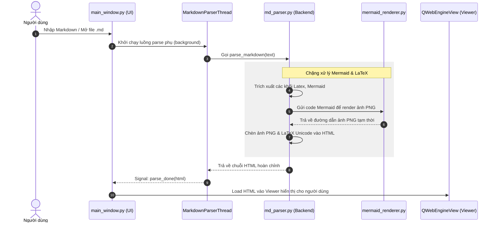

<!--
File: docs/architecture/ARCHITECTURE_MAP.md
CHỨC NĂNG: Bản đồ master kiến trúc kỹ thuật dự án Markdown Viewer
CHANGELOG:
- 14:58:00 02/07/2026: [UPDATE] Cập nhật bản đồ kiến trúc phù hợp với dự án Markdown Viewer (Lê Thanh Vân/Antigravity)
- 10:40:00 02/07/2026: [NEW] Khởi tạo bản đồ kiến trúc cho dự án (Lê Thanh Vân/Antigravity)
-->

# 🛡️ BẢN ĐỒ KIẾN TRÚC MASTER: MARKDOWN VIEWER

> **Mã dự án**: 46_MARKDOWN_VIEWER_02426
> **Ngôn ngữ**: Python 3.12+ | **Framework UI**: PyQt6 (QWebEngineView, QSplitter)
> **Kiến trúc**: Separation of Concerns (Phân tách Trách nhiệm - Giao diện Frontend tách biệt Bộ phân tích Parser Backend)

---

## 📂 1. CẤU TRÚC THƯ MỤC DỰ ÁN (Project Structure)

Để đảm bảo dự án phát triển bền vững, không bị phình to code và dễ bảo trì, cấu trúc thư mục được thiết kế chuẩn mực như sau:

```
46_MARKDOWN_VIEWER_02426/
│
├── main.py                  # Điểm chạy chính khởi tạo ứng dụng PyQt6
├── config.py                # Cấu hình cài đặt ứng dụng (thư mục, phiên bản, theme)
├── settings.json            # Lưu cấu hình người dùng (lịch sử file, theme, kích thước cửa sổ)
├── requirements.txt         # Danh sách thư viện Python phụ thuộc
│
├── backend/                 # TẦNG CORE LOGIC & PARSING (Tuyệt đối cấm import PyQt6 tại đây)
│   ├── __init__.py
│   ├── md_parser.py         # Biên dịch Markdown sang HTML, hỗ trợ LaTeX, Mermaid & xuất PDF/DOCX
│   └── mermaid_renderer.py  # Render sơ đồ Mermaid bất đồng bộ sang ảnh PNG bằng tiến trình con QWebEngineView
│
├── frontend/                # TẦNG GIAO DIỆN PYQT6 (Chỉ xử lý hiển thị)
│   ├── __init__.py
│   ├── main_window.py       # Cửa sổ chính: Editor bên trái, WebViewer bên phải, Sidebar lịch sử, Search Panel
│   └── styles.py            # CSS template cho Markdown render & QSS cho giao diện PyQt6
│
├── docs/                    # TÀI LIỆU DỰ ÁN & BÁO CÁO AUDIT
│   ├── architecture/
│   │   ├── ARCHITECTURE_MAP.md # File này (Bản đồ Master)
│   │   └── MAP_GRAPH.md        # Đồ thị liên kết codebase tự động
│   └── ...
│
├── scripts/                 # CÔNG CỤ ĐẢM BẢO CHẤT LƯỢNG (Audit, Linter, Git Guard)
├── scratch/                 # File tạm, script thử nghiệm
└── temp_render/             # Folder trung gian lưu trữ file HTML/PNG tạm thời trong quá trình render
```

---

## 🔄 2. LUỒNG DỮ LIỆU & CƠ CHẾ RENDER (Data & Render Flow)

Ứng dụng hoạt động theo cơ chế render bất đồng bộ (Multi-threading) để giữ giao diện UI mượt mà, không bị kẹt khi parse các tài liệu Markdown lớn hoặc chứa sơ đồ Mermaid phức tạp.



---

## 📏 3. RÀNG BUỘC CHẤT LƯỢNG CODE CỨNG (Strict Limits)

Để đảm bảo hệ thống không bị phình to và luôn sạch đẹp, mọi chỉnh sửa mã nguồn bắt buộc phải vượt qua các ngưỡng kiểm soát chất lượng cục bộ của `scripts/audit_code_quality.py` và quy định chung:

1. **Độ dài tệp tin (File Length)**: Tối đa **800 dòng** (Hard Limit). Lên kế hoạch chia nhỏ ở **500 dòng** (Soft Limit).
2. **Độ dài hàm (Function Length)**: Tối đa **100 dòng** (Hard Limit). Khuyến nghị dưới **50 dòng** (Soft Limit).
3. **Số lượng đối số (Arguments)**: Tối đa **4 đối số** thực tế trong một hàm (không tính `self`, `cls`). Nếu nhiều hơn, bắt buộc gom thành Dictionary hoặc Data Class.
4. **Type Hints**: Khai báo đầy đủ 100% cho mọi đối số và kiểu trả về (ngoại trừ hàm khởi tạo `__init__` trả về `None`).
5. **Docstrings**: Sử dụng Google-Style docstring đầy đủ cho các hàm và class mới.
6. **Xử lý ngoại lệ**: Tuyệt đối cấm nuốt lỗi im lặng (`except: pass`). Mọi exception bắt buộc phải ghi nhận qua `logger.error` hoặc được re-raise.

---

## 📈 4. DANH SÁCH TÍNH NĂNG CHÍNH (Features)

- [x] **Markdown Engine**: Parse đầy đủ Github Flavored Markdown (tables, task list, code block).
- [x] **LaTeX Math Support**: Hỗ trợ hiển thị công thức toán học Inline và Block bằng Unicode/MathJax.
- [x] **Mermaid Diagram**: Render sơ đồ Mermaid trực quan trực tiếp trên giao diện Viewer.
- [x] **Notepad++ Style Search**: Tìm kiếm text trong Editor & Viewer, hiển thị panel tổng hợp kết quả (Search Results Panel).
- [x] **Dark/Light Theme**: Hỗ trợ chuyển đổi giao diện sáng/tối đồng bộ cả UI và nội dung văn bản.
- [x] **Export PDF/Word**: Cho phép xuất tài liệu Markdown sang PDF và file Microsoft Word (.docx) kèm hình ảnh sơ đồ.
- [x] **Auto Reload**: Tự động phát hiện thay đổi của tệp tin từ bên ngoài ứng dụng và tải lại nội dung tức thời.
