<!--
File: docs/architecture/MAP_GRAPH.md
Description: 🌐 ĐỒ THỊ LIÊN KẾT CODEBASE MARKDOWN VIEWER
CHANGELOG:
- 14:55:00 02/07/2026: [UPDATE] Cập nhật đồ thị sang backend/frontend của dự án Markdown Viewer (Lê Thanh Vân/Antigravity)
-->

# 🌐 ĐỒ THỊ LIÊN KẾT CODEBASE MARKDOWN VIEWER

> [!TIP]
> Tài liệu này được tự động cập nhật bằng cơ chế **Incremental Cache** siêu tốc.
> Giúp hình dung rõ ràng mối liên kết gọi hàm và kế thừa trong toàn bộ hệ thống Markdown Viewer.

---

## 💾 1. Đồ thị liên kết Backend & Core (Phân tích cú pháp Markdown, Latex, Mermaid)

```mermaid
graph TD
    classDef file fill:#f9f,stroke:#333,stroke-width:1px;
    classDef cls fill:#bbf,stroke:#333,stroke-width:1px;
    classDef func fill:#bfb,stroke:#333,stroke-width:1px;
    config["📄 config.py"]:::file
    main["📄 main.py"]:::file
    main_main["⚙️ main()"]:::func
    backend_exporters["📄 exporters.py"]:::file
    backend_exporters_export_to_docx["⚙️ export_to_docx()"]:::func
    backend_exporters_replace_mermaid["⚙️ replace_mermaid()"]:::func
    backend_md_parser["📄 md_parser.py"]:::file
    backend_md_parser_find_matching_brace["⚙️ find_matching_brace()"]:::func
    backend_md_parser_parse_braces_content["⚙️ parse_braces_content()"]:::func
    backend_md_parser_latex_to_unicode["⚙️ latex_to_unicode()"]:::func
    backend_md_parser_process_recursive_commands["⚙️ process_recursive_commands()"]:::func
    backend_md_parser_replace_sub["⚙️ replace_sub()"]:::func
    backend_md_parser_replace_super["⚙️ replace_super()"]:::func
    backend_md_parser_replace_block_math["⚙️ replace_block_math()"]:::func
    backend_md_parser_replace_inline_math["⚙️ replace_inline_math()"]:::func
    backend_md_parser_clean_latex_in_markdown["⚙️ clean_latex_in_markdown()"]:::func
    backend_md_parser_open_file_with_default_app["⚙️ open_file_with_default_app()"]:::func
    backend_md_parser_open_folder_and_select_file["⚙️ open_folder_and_select_file()"]:::func
    backend_md_parser__get_mathjax_mermaid_header["⚙️ _get_mathjax_mermaid_header()"]:::func
    backend_md_parser__get_mermaid_zoom_modal_html["⚙️ _get_mermaid_zoom_modal_html()"]:::func
    backend_md_parser__get_mermaid_zoom_script["⚙️ _get_mermaid_zoom_script()"]:::func
    backend_md_parser_render_markdown_to_html["⚙️ render_markdown_to_html()"]:::func
    backend_mermaid_renderer["📄 mermaid_renderer.py"]:::file
    backend_mermaid_renderer_MermaidRenderer["🧩 MermaidRenderer"]:::cls
    backend_mermaid_renderer__get_mermaid_html_template["⚙️ _get_mermaid_html_template()"]:::func
    backend_mermaid_renderer_MermaidRenderer___init__["⚙️ __init__()"]:::func
    backend_mermaid_renderer_MermaidRenderer_render_to_image["⚙️ render_to_image()"]:::func
    backend_mermaid_renderer_MermaidRenderer_check_status["⚙️ check_status()"]:::func
    backend_mermaid_renderer_MermaidRenderer_get_size["⚙️ get_size()"]:::func
    backend_mermaid_renderer_MermaidRenderer_cleanup["⚙️ cleanup()"]:::func
    backend___init__["📄 __init__.py"]:::file
    main -->|contains| main_main
    backend_exporters -->|contains| backend_exporters_export_to_docx
    backend_exporters -->|contains| backend_exporters_replace_mermaid
    backend_md_parser -->|contains| backend_md_parser_find_matching_brace
    backend_md_parser -->|contains| backend_md_parser_parse_braces_content
    backend_md_parser -->|contains| backend_md_parser_latex_to_unicode
    backend_md_parser -->|contains| backend_md_parser_process_recursive_commands
    backend_md_parser -->|contains| backend_md_parser_replace_sub
    backend_md_parser -->|contains| backend_md_parser_replace_super
    backend_md_parser -->|contains| backend_md_parser_replace_block_math
    backend_md_parser -->|contains| backend_md_parser_replace_inline_math
    backend_md_parser -->|contains| backend_md_parser_clean_latex_in_markdown
    backend_md_parser -->|contains| backend_md_parser_open_file_with_default_app
    backend_md_parser -->|contains| backend_md_parser_open_folder_and_select_file
    backend_md_parser -->|contains| backend_md_parser__get_mathjax_mermaid_header
    backend_md_parser -->|contains| backend_md_parser__get_mermaid_zoom_modal_html
    backend_md_parser -->|contains| backend_md_parser__get_mermaid_zoom_script
    backend_md_parser -->|contains| backend_md_parser_render_markdown_to_html
    backend_mermaid_renderer -->|contains| backend_mermaid_renderer_MermaidRenderer
    backend_mermaid_renderer -->|contains| backend_mermaid_renderer__get_mermaid_html_template
    backend_mermaid_renderer_MermaidRenderer -->|contains| backend_mermaid_renderer_MermaidRenderer___init__
    backend_mermaid_renderer_MermaidRenderer -->|contains| backend_mermaid_renderer_MermaidRenderer_render_to_image
    backend_mermaid_renderer_MermaidRenderer -->|contains| backend_mermaid_renderer_MermaidRenderer_check_status
    backend_mermaid_renderer_MermaidRenderer -->|contains| backend_mermaid_renderer_MermaidRenderer_get_size
    backend_mermaid_renderer_MermaidRenderer -->|contains| backend_mermaid_renderer_MermaidRenderer_cleanup
    backend_exporters_export_to_docx ==>|calls| backend_mermaid_renderer_MermaidRenderer
    backend_exporters_replace_mermaid ==>|calls| backend_mermaid_renderer_MermaidRenderer_render_to_image
    backend_exporters_export_to_docx ==>|calls| backend_md_parser_clean_latex_in_markdown
    backend_md_parser_parse_braces_content ==>|calls| backend_md_parser_find_matching_brace
    backend_md_parser_latex_to_unicode ==>|calls| backend_md_parser_process_recursive_commands
    backend_md_parser_process_recursive_commands ==>|calls| backend_md_parser_parse_braces_content
    backend_md_parser_process_recursive_commands ==>|calls| backend_md_parser_process_recursive_commands
    backend_md_parser_replace_block_math ==>|calls| backend_md_parser_latex_to_unicode
    backend_md_parser_replace_inline_math ==>|calls| backend_md_parser_latex_to_unicode
    backend_md_parser_render_markdown_to_html ==>|calls| backend_md_parser__get_mathjax_mermaid_header
    backend_md_parser_render_markdown_to_html ==>|calls| backend_md_parser__get_mermaid_zoom_modal_html
    backend_md_parser_render_markdown_to_html ==>|calls| backend_md_parser__get_mermaid_zoom_script
    backend_mermaid_renderer_MermaidRenderer_render_to_image ==>|calls| backend_mermaid_renderer__get_mermaid_html_template
```


---

## 🎨 2. Đồ thị liên kết Frontend PyQt6 (Giao diện Markdown Viewer)
```mermaid
graph TD
    classDef file fill:#f9f,stroke:#333,stroke-width:1px;
    classDef cls fill:#bbf,stroke:#333,stroke-width:1px;
    classDef func fill:#bfb,stroke:#333,stroke-width:1px;
    frontend_main_window["📄 main_window.py"]:::file
    frontend_main_window_MainWindow["🧩 MainWindow"]:::cls
    frontend_main_window_MainWindow___init__["⚙️ __init__()"]:::func
    frontend_main_window_MainWindow__init_ui["⚙️ _init_ui()"]:::func
    frontend_main_window_MainWindow__init_ui_splitters["⚙️ _init_ui_splitters()"]:::func
    frontend_main_window_MainWindow__init_search_panel["⚙️ _init_search_panel()"]:::func
    frontend_main_window_MainWindow__init_shortcuts_and_status["⚙️ _init_shortcuts_and_status()"]:::func
    frontend_main_window_MainWindow_on_toc_navigation["⚙️ on_toc_navigation()"]:::func
    frontend_main_window_MainWindow__init_toolbar["⚙️ _init_toolbar()"]:::func
    frontend_main_window_MainWindow_apply_theme["⚙️ apply_theme()"]:::func
    frontend_main_window_MainWindow_toggle_theme["⚙️ toggle_theme()"]:::func
    frontend_main_window_MainWindow_toggle_orientation["⚙️ toggle_orientation()"]:::func
    frontend_main_window_MainWindow_load_settings["⚙️ load_settings()"]:::func
    frontend_main_window_MainWindow_save_settings["⚙️ save_settings()"]:::func
    frontend_main_window_MainWindow_open_file_dialog["⚙️ open_file_dialog()"]:::func
    frontend_main_window_MainWindow_load_markdown["⚙️ load_markdown()"]:::func
    frontend_main_window_MainWindow_refresh_file_list_ui["⚙️ refresh_file_list_ui()"]:::func
    frontend_main_window_MainWindow_show_sidebar_context_menu["⚙️ show_sidebar_context_menu()"]:::func
    frontend_main_window_MainWindow_remove_selected_from_history["⚙️ remove_selected_from_history()"]:::func
    frontend_main_window_MainWindow_on_file_item_clicked["⚙️ on_file_item_clicked()"]:::func
    frontend_main_window_MainWindow_render_viewer["⚙️ render_viewer()"]:::func
    frontend_main_window_MainWindow_show_search_panel["⚙️ show_search_panel()"]:::func
    frontend_main_window_MainWindow_hide_search_panel["⚙️ hide_search_panel()"]:::func
    frontend_main_window_MainWindow_on_search_text_changed["⚙️ on_search_text_changed()"]:::func
    frontend_main_window_MainWindow_find_all_and_show["⚙️ find_all_and_show()"]:::func
    frontend_main_window_MainWindow_on_search_result_clicked["⚙️ on_search_result_clicked()"]:::func
    frontend_main_window_MainWindow_do_search["⚙️ do_search()"]:::func
    frontend_main_window_MainWindow_on_parse_done["⚙️ on_parse_done()"]:::func
    frontend_main_window_MainWindow_on_file_changed_externally["⚙️ on_file_changed_externally()"]:::func
    frontend_main_window_MainWindow_save_current_file["⚙️ save_current_file()"]:::func
    frontend_main_window_MainWindow_on_tab_changed["⚙️ on_tab_changed()"]:::func
    frontend_main_window_MainWindow_export_pdf["⚙️ export_pdf()"]:::func
    frontend_main_window_MainWindow_on_pdf_finished["⚙️ on_pdf_finished()"]:::func
    frontend_main_window_MainWindow_export_docx["⚙️ export_docx()"]:::func
    frontend_main_window_MainWindow__show_export_success_dialog["⚙️ _show_export_success_dialog()"]:::func
    frontend_main_window_MainWindow_on_error["⚙️ on_error()"]:::func
    frontend_styles["📄 styles.py"]:::file
    frontend_styles_get_full_css["⚙️ get_full_css()"]:::func
    frontend___init__["📄 __init__.py"]:::file
    frontend_components_editor["📄 editor.py"]:::file
    frontend_components_editor_LineNumberArea["🧩 LineNumberArea"]:::cls
    frontend_components_editor_CodeEditor["🧩 CodeEditor"]:::cls
    frontend_components_editor_LineNumberArea___init__["⚙️ __init__()"]:::func
    frontend_components_editor_LineNumberArea_sizeHint["⚙️ sizeHint()"]:::func
    frontend_components_editor_LineNumberArea_paintEvent["⚙️ paintEvent()"]:::func
    frontend_components_editor_CodeEditor___init__["⚙️ __init__()"]:::func
    frontend_components_editor_CodeEditor_set_dark_mode["⚙️ set_dark_mode()"]:::func
    frontend_components_editor_CodeEditor_set_search_term["⚙️ set_search_term()"]:::func
    frontend_components_editor_CodeEditor_lineNumberAreaWidth["⚙️ lineNumberAreaWidth()"]:::func
    frontend_components_editor_CodeEditor_updateLineNumberAreaWidth["⚙️ updateLineNumberAreaWidth()"]:::func
    frontend_components_editor_CodeEditor_updateLineNumberArea["⚙️ updateLineNumberArea()"]:::func
    frontend_components_editor_CodeEditor_resizeEvent["⚙️ resizeEvent()"]:::func
    frontend_components_editor_CodeEditor_lineNumberAreaPaintEvent["⚙️ lineNumberAreaPaintEvent()"]:::func
    frontend_components_editor_CodeEditor_highlightCurrentLine["⚙️ highlightCurrentLine()"]:::func
    frontend_components_parser_thread["📄 parser_thread.py"]:::file
    frontend_components_parser_thread_MarkdownParserThread["🧩 MarkdownParserThread"]:::cls
    frontend_components_parser_thread_MarkdownParserThread___init__["⚙️ __init__()"]:::func
    frontend_components_parser_thread_MarkdownParserThread_run["⚙️ run()"]:::func
    frontend_components_search_panel["📄 search_panel.py"]:::file
    frontend_components_search_panel_SearchResultPanel["🧩 SearchResultPanel"]:::cls
    frontend_components_search_panel_SearchResultPanel___init__["⚙️ __init__()"]:::func
    frontend_components_search_panel_SearchResultPanel_add_result["⚙️ add_result()"]:::func
    frontend_components_search_panel_SearchResultPanel_set_dark_mode["⚙️ set_dark_mode()"]:::func
    frontend_components_search_panel_SearchResultPanel_on_item_clicked["⚙️ on_item_clicked()"]:::func
    frontend_main_window -->|contains| frontend_main_window_MainWindow
    frontend_main_window_MainWindow -->|contains| frontend_main_window_MainWindow___init__
    frontend_main_window_MainWindow -->|contains| frontend_main_window_MainWindow__init_ui
    frontend_main_window_MainWindow -->|contains| frontend_main_window_MainWindow__init_ui_splitters
    frontend_main_window_MainWindow -->|contains| frontend_main_window_MainWindow__init_search_panel
    frontend_main_window_MainWindow -->|contains| frontend_main_window_MainWindow__init_shortcuts_and_status
    frontend_main_window_MainWindow -->|contains| frontend_main_window_MainWindow_on_toc_navigation
    frontend_main_window_MainWindow -->|contains| frontend_main_window_MainWindow__init_toolbar
    frontend_main_window_MainWindow -->|contains| frontend_main_window_MainWindow_apply_theme
    frontend_main_window_MainWindow -->|contains| frontend_main_window_MainWindow_toggle_theme
    frontend_main_window_MainWindow -->|contains| frontend_main_window_MainWindow_toggle_orientation
    frontend_main_window_MainWindow -->|contains| frontend_main_window_MainWindow_load_settings
    frontend_main_window_MainWindow -->|contains| frontend_main_window_MainWindow_save_settings
    frontend_main_window_MainWindow -->|contains| frontend_main_window_MainWindow_open_file_dialog
    frontend_main_window_MainWindow -->|contains| frontend_main_window_MainWindow_load_markdown
    frontend_main_window_MainWindow -->|contains| frontend_main_window_MainWindow_refresh_file_list_ui
    frontend_main_window_MainWindow -->|contains| frontend_main_window_MainWindow_show_sidebar_context_menu
    frontend_main_window_MainWindow -->|contains| frontend_main_window_MainWindow_remove_selected_from_history
    frontend_main_window_MainWindow -->|contains| frontend_main_window_MainWindow_on_file_item_clicked
    frontend_main_window_MainWindow -->|contains| frontend_main_window_MainWindow_render_viewer
    frontend_main_window_MainWindow -->|contains| frontend_main_window_MainWindow_show_search_panel
    frontend_main_window_MainWindow -->|contains| frontend_main_window_MainWindow_hide_search_panel
    frontend_main_window_MainWindow -->|contains| frontend_main_window_MainWindow_on_search_text_changed
    frontend_main_window_MainWindow -->|contains| frontend_main_window_MainWindow_find_all_and_show
    frontend_main_window_MainWindow -->|contains| frontend_main_window_MainWindow_on_search_result_clicked
    frontend_main_window_MainWindow -->|contains| frontend_main_window_MainWindow_do_search
    frontend_main_window_MainWindow -->|contains| frontend_main_window_MainWindow_on_parse_done
    frontend_main_window_MainWindow -->|contains| frontend_main_window_MainWindow_on_file_changed_externally
    frontend_main_window_MainWindow -->|contains| frontend_main_window_MainWindow_save_current_file
    frontend_main_window_MainWindow -->|contains| frontend_main_window_MainWindow_on_tab_changed
    frontend_main_window_MainWindow -->|contains| frontend_main_window_MainWindow_export_pdf
    frontend_main_window_MainWindow -->|contains| frontend_main_window_MainWindow_on_pdf_finished
    frontend_main_window_MainWindow -->|contains| frontend_main_window_MainWindow_export_docx
    frontend_main_window_MainWindow -->|contains| frontend_main_window_MainWindow__show_export_success_dialog
    frontend_main_window_MainWindow -->|contains| frontend_main_window_MainWindow_on_error
    frontend_styles -->|contains| frontend_styles_get_full_css
    frontend_components_editor -->|contains| frontend_components_editor_LineNumberArea
    frontend_components_editor -->|contains| frontend_components_editor_CodeEditor
    frontend_components_editor_LineNumberArea -->|contains| frontend_components_editor_LineNumberArea___init__
    frontend_components_editor_LineNumberArea -->|contains| frontend_components_editor_LineNumberArea_sizeHint
    frontend_components_editor_LineNumberArea -->|contains| frontend_components_editor_LineNumberArea_paintEvent
    frontend_components_editor_CodeEditor -->|contains| frontend_components_editor_CodeEditor___init__
    frontend_components_editor_CodeEditor -->|contains| frontend_components_editor_CodeEditor_set_dark_mode
    frontend_components_editor_CodeEditor -->|contains| frontend_components_editor_CodeEditor_set_search_term
    frontend_components_editor_CodeEditor -->|contains| frontend_components_editor_CodeEditor_lineNumberAreaWidth
    frontend_components_editor_CodeEditor -->|contains| frontend_components_editor_CodeEditor_updateLineNumberAreaWidth
    frontend_components_editor_CodeEditor -->|contains| frontend_components_editor_CodeEditor_updateLineNumberArea
    frontend_components_editor_CodeEditor -->|contains| frontend_components_editor_CodeEditor_resizeEvent
    frontend_components_editor_CodeEditor -->|contains| frontend_components_editor_CodeEditor_lineNumberAreaPaintEvent
    frontend_components_editor_CodeEditor -->|contains| frontend_components_editor_CodeEditor_highlightCurrentLine
    frontend_components_parser_thread -->|contains| frontend_components_parser_thread_MarkdownParserThread
    frontend_components_parser_thread_MarkdownParserThread -->|contains| frontend_components_parser_thread_MarkdownParserThread___init__
    frontend_components_parser_thread_MarkdownParserThread -->|contains| frontend_components_parser_thread_MarkdownParserThread_run
    frontend_components_search_panel -->|contains| frontend_components_search_panel_SearchResultPanel
    frontend_components_search_panel_SearchResultPanel -->|contains| frontend_components_search_panel_SearchResultPanel___init__
    frontend_components_search_panel_SearchResultPanel -->|contains| frontend_components_search_panel_SearchResultPanel_add_result
    frontend_components_search_panel_SearchResultPanel -->|contains| frontend_components_search_panel_SearchResultPanel_set_dark_mode
    frontend_components_search_panel_SearchResultPanel -->|contains| frontend_components_search_panel_SearchResultPanel_on_item_clicked
    frontend_main_window_MainWindow___init__ ==>|calls| frontend_main_window_MainWindow__init_ui
    frontend_main_window_MainWindow___init__ ==>|calls| frontend_main_window_MainWindow_load_settings
    frontend_main_window_MainWindow__init_ui ==>|calls| frontend_main_window_MainWindow__init_ui_splitters
    frontend_main_window_MainWindow__init_ui ==>|calls| frontend_main_window_MainWindow__init_toolbar
    frontend_main_window_MainWindow__init_ui ==>|calls| frontend_main_window_MainWindow__init_search_panel
    frontend_main_window_MainWindow__init_ui ==>|calls| frontend_main_window_MainWindow__init_shortcuts_and_status
    frontend_main_window_MainWindow__init_ui_splitters ==>|calls| frontend_components_editor_CodeEditor
    frontend_main_window_MainWindow__init_search_panel ==>|calls| frontend_main_window_MainWindow_do_search
    frontend_main_window_MainWindow__init_search_panel ==>|calls| frontend_components_search_panel_SearchResultPanel
    frontend_main_window_MainWindow_apply_theme ==>|calls| frontend_main_window_MainWindow_render_viewer
    frontend_main_window_MainWindow_toggle_theme ==>|calls| frontend_main_window_MainWindow_apply_theme
    frontend_main_window_MainWindow_load_settings ==>|calls| frontend_main_window_MainWindow_apply_theme
    frontend_main_window_MainWindow_load_settings ==>|calls| frontend_main_window_MainWindow_refresh_file_list_ui
    frontend_main_window_MainWindow_load_settings ==>|calls| frontend_main_window_MainWindow_load_markdown
    frontend_main_window_MainWindow_open_file_dialog ==>|calls| frontend_main_window_MainWindow_load_markdown
    frontend_main_window_MainWindow_load_markdown ==>|calls| frontend_main_window_MainWindow_refresh_file_list_ui
    frontend_main_window_MainWindow_load_markdown ==>|calls| frontend_main_window_MainWindow_save_settings
    frontend_main_window_MainWindow_load_markdown ==>|calls| frontend_main_window_MainWindow_render_viewer
    frontend_main_window_MainWindow_show_sidebar_context_menu ==>|calls| frontend_main_window_MainWindow_remove_selected_from_history
    frontend_main_window_MainWindow_remove_selected_from_history ==>|calls| frontend_main_window_MainWindow_refresh_file_list_ui
    frontend_main_window_MainWindow_remove_selected_from_history ==>|calls| frontend_main_window_MainWindow_save_settings
    frontend_main_window_MainWindow_on_file_item_clicked ==>|calls| frontend_main_window_MainWindow_load_markdown
    frontend_main_window_MainWindow_render_viewer ==>|calls| frontend_components_parser_thread_MarkdownParserThread
    frontend_main_window_MainWindow_hide_search_panel ==>|calls| frontend_components_editor_CodeEditor_set_search_term
    frontend_main_window_MainWindow_on_search_text_changed ==>|calls| frontend_components_editor_CodeEditor_set_search_term
    frontend_main_window_MainWindow_find_all_and_show ==>|calls| frontend_components_search_panel_SearchResultPanel_add_result
    frontend_main_window_MainWindow_on_parse_done ==>|calls| frontend_styles_get_full_css
    frontend_main_window_MainWindow_on_file_changed_externally ==>|calls| frontend_main_window_MainWindow_load_markdown
    frontend_main_window_MainWindow_save_current_file ==>|calls| frontend_main_window_MainWindow_render_viewer
    frontend_main_window_MainWindow_on_tab_changed ==>|calls| frontend_main_window_MainWindow_render_viewer
    frontend_main_window_MainWindow_on_tab_changed ==>|calls| frontend_main_window_MainWindow_on_search_text_changed
    frontend_main_window_MainWindow_on_pdf_finished ==>|calls| frontend_main_window_MainWindow__show_export_success_dialog
    frontend_main_window_MainWindow_export_docx ==>|calls| frontend_main_window_MainWindow__show_export_success_dialog
    frontend_components_editor_LineNumberArea_sizeHint ==>|calls| frontend_components_editor_CodeEditor_lineNumberAreaWidth
    frontend_components_editor_LineNumberArea_paintEvent ==>|calls| frontend_components_editor_CodeEditor_lineNumberAreaPaintEvent
    frontend_components_editor_CodeEditor___init__ ==>|calls| frontend_components_editor_LineNumberArea
    frontend_components_editor_CodeEditor___init__ ==>|calls| frontend_components_editor_CodeEditor_updateLineNumberAreaWidth
    frontend_components_editor_CodeEditor___init__ ==>|calls| frontend_components_editor_CodeEditor_highlightCurrentLine
    frontend_components_editor_CodeEditor_set_dark_mode ==>|calls| frontend_components_editor_CodeEditor_highlightCurrentLine
    frontend_components_editor_CodeEditor_set_search_term ==>|calls| frontend_components_editor_CodeEditor_highlightCurrentLine
    frontend_components_editor_CodeEditor_updateLineNumberAreaWidth ==>|calls| frontend_components_editor_CodeEditor_lineNumberAreaWidth
    frontend_components_editor_CodeEditor_updateLineNumberArea ==>|calls| frontend_components_editor_CodeEditor_updateLineNumberAreaWidth
    frontend_components_editor_CodeEditor_resizeEvent ==>|calls| frontend_components_editor_CodeEditor_resizeEvent
    frontend_components_editor_CodeEditor_resizeEvent ==>|calls| frontend_components_editor_CodeEditor_lineNumberAreaWidth
```
