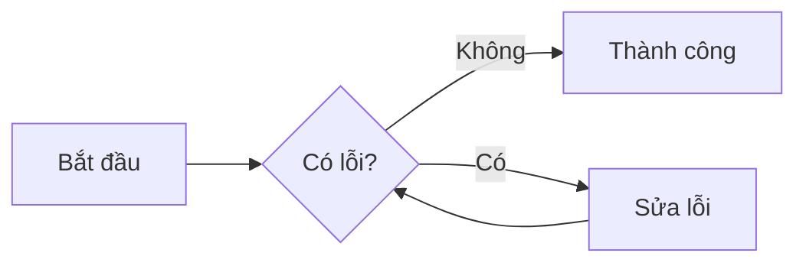

# Test Markdown Title

Đây là một đoạn văn bản mẫu để kiểm tra tính năng render.

## Kiểm tra Công thức Toán (MathJax)

Công thức Einstein: $E = mc^2$

Công thức bậc hai:

$$
x = \frac{-b \pm \sqrt{b^2 - 4ac}}{2a}
$$

## Kiểm tra Bảng (Table)

| STT | Tên Công Việc | Trạng Thái |
| :-- | :--------------- | :----------- |
| 1   | Sửa lỗi Import | Hoàn thành |
| 2   | Nâng cấp CSS   | Hoàn thành |
| 3   | Thêm MathJax    | Hoàn thành |

## Kiểm tra Code Block

```python
def hello_world():
    print("Chào anh Lưu!")
```

## Kiểm tra Hình ảnh mẫu


!!! note "Ghi chú"
    Đây là tính năng Admonition được kích hoạt qua extension `admonition`.

## Kiểm tra Biểu đồ (Mermaid)


